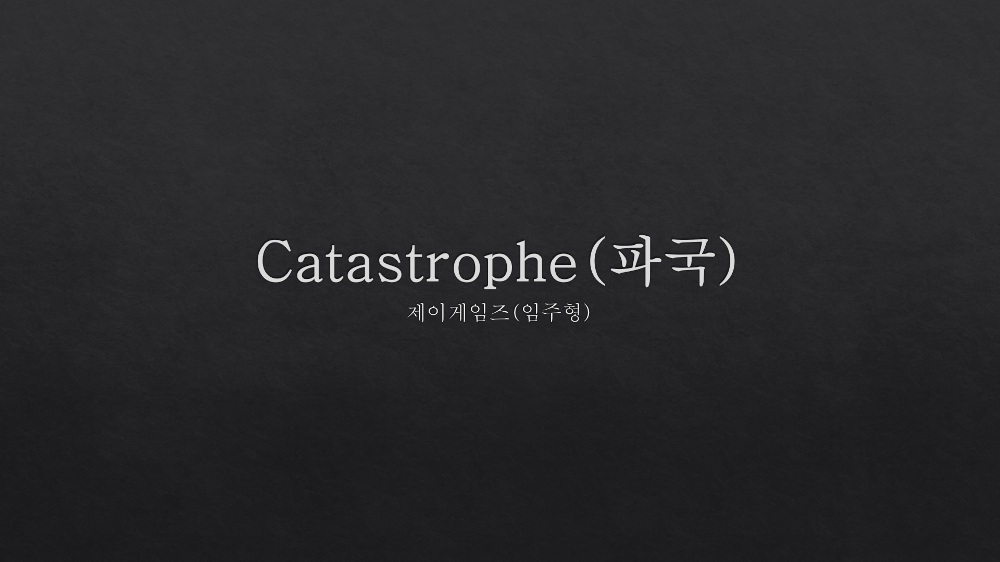
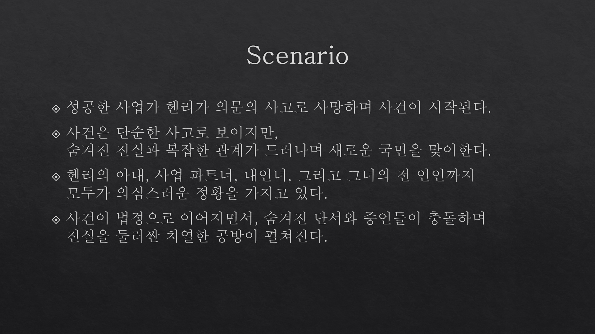
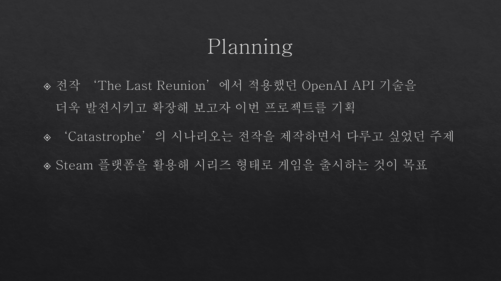
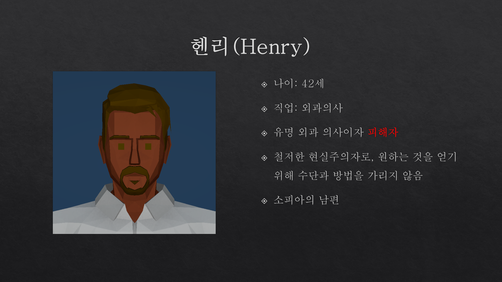
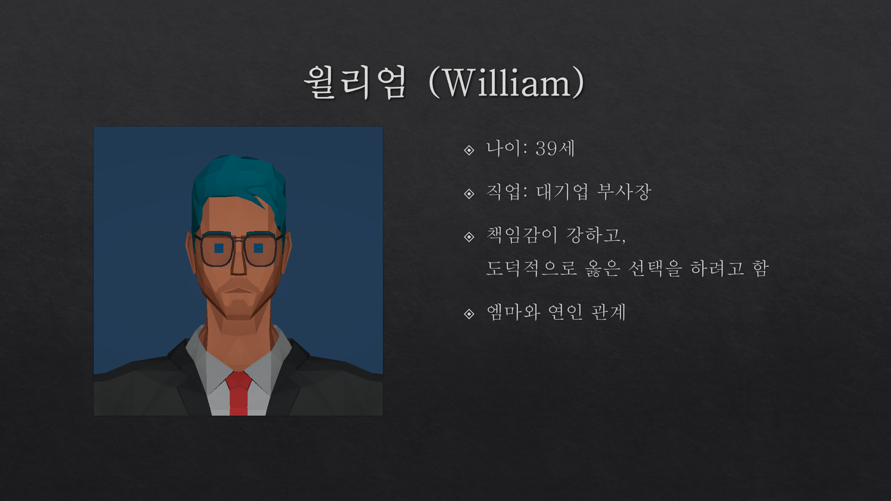
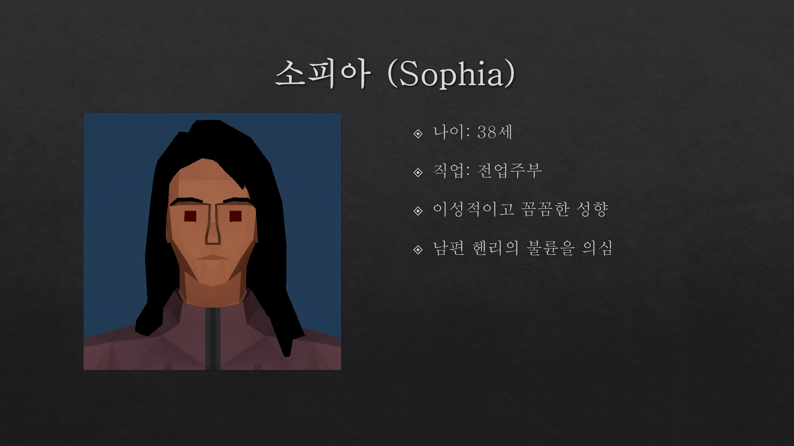
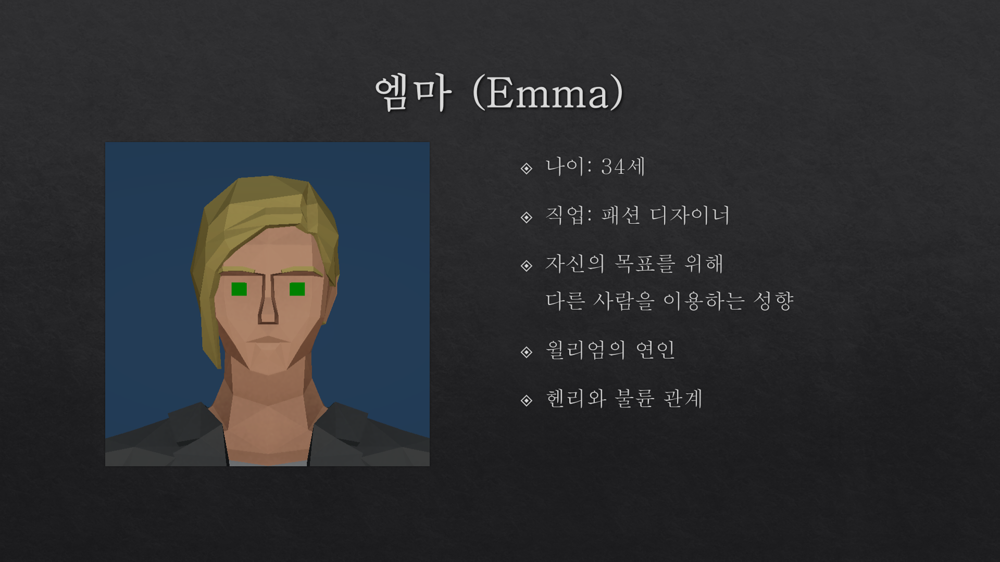
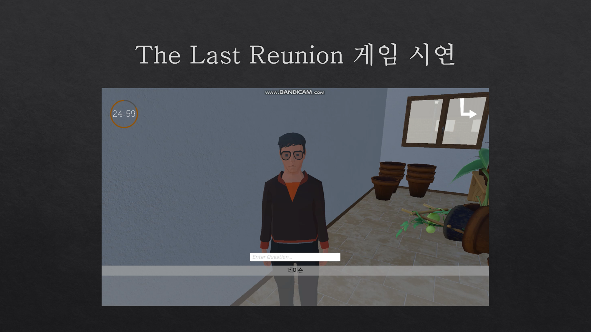
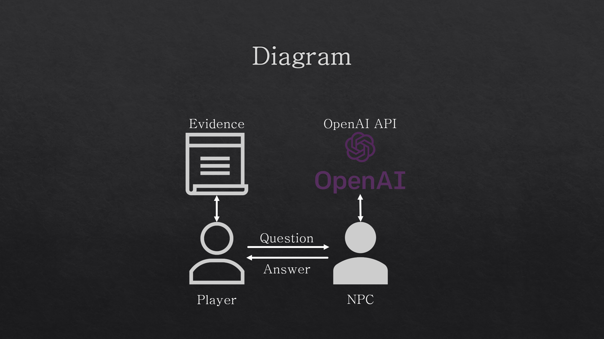

### ⚖️ Catastrophe (개발 중)

- **장르**: 법정 추리 인터랙티브 게임
- **개발 기간**: 2025.03 ~ 진행 중
- **사용 기술**: Unity, C#, OpenAI API, ElevenLabs
- **주요 기능**:
  - 검사 시점의 수사 및 재판 진행 시스템
  - 해석 중심 증거 시스템
  - AI 음성 합성 기반 캐릭터 대사 시스템

- **기여 내용**:
  - OpenAI API를 활용해 NPC에게 페르소나를 부여하고, 상황에 따른 반응 설계
  - ElevenLabs Voice Design을 활용해 각 캐릭터의 음성 생성
  - 증거, 진술, 감정 흐름을 데이터 기반으로 처리할 수 있는 구조 설계
  - 재판 과정에서 AI와의 법적 공방 과정 구현

- **진행 상황**:
  - 사건의 전반적인 시나리오 구성 완료
  - 레벨 디자인 진행 중
  - GPT-4o-mini 성능 테스트 중

- **플레이 스타일 요약**:
  - 플레이어는 검사로서 증거를 수집하고 시나리오를 따라가며 사건의 진실을 파악합니다.
  - NPC와의 대화를 통해 단서를 확보하고, 각 인물의 진술을 분석합니다.
  - 수집한 정보와 추리를 바탕으로 최종 단계인 법정에서 AI와 치열한 공방을 펼치게 됩니다.

 📌 개발 완료 후 Steam 또는 Itch.io에 출시 예정입니다.  

---

